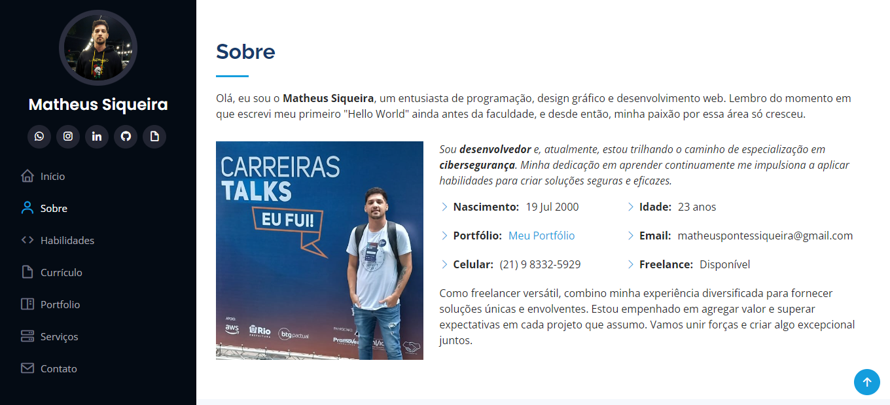
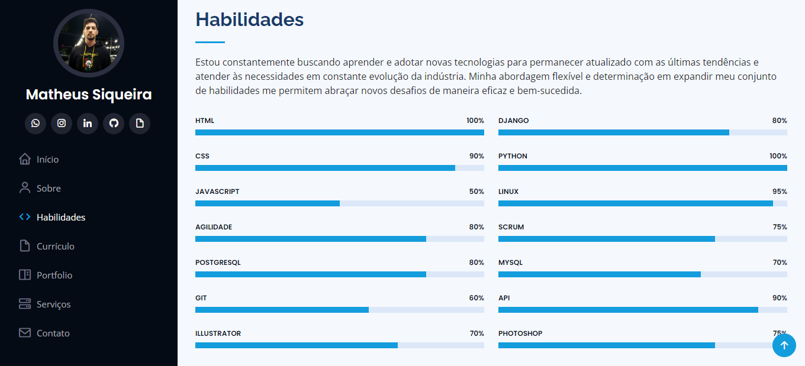
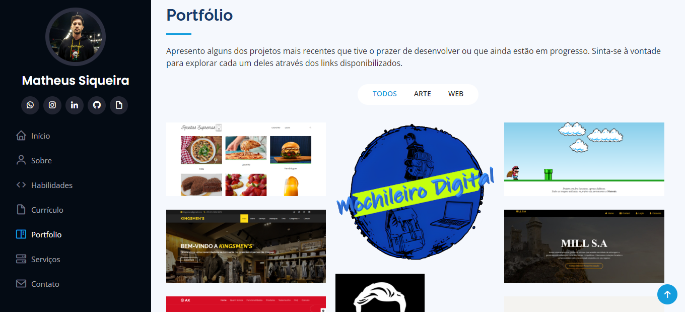
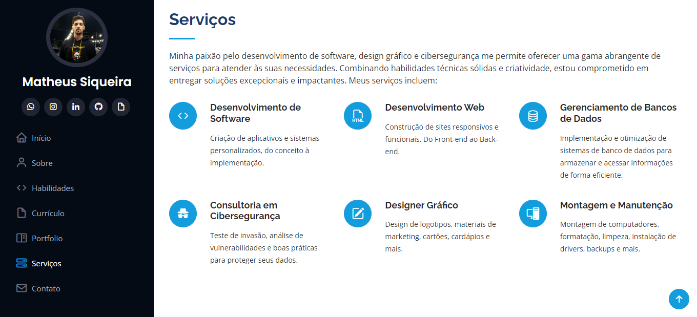

# Meu Portfólio Pessoal 

## Descrição:

Bem-vindo ao meu Portfólio Pessoal! Neste projeto, desenvolvi um espaço para compartilhar alguns dos projetos que venho criando. Aqui, você encontrará um panorama do meu trabalho, que abrange tanto a programação quanto o design gráfico. Além disso, você terá a oportunidade de conhecer um pouco mais sobre mim e minhas ambições atuais.

## Tecnologias Utilizadas:

Durante a criação deste portfólio, utilizei uma combinação de tecnologias, incluindo:

- HTML5.
- CSS3.
- Bootstrap.
- Toques sutis de JavaScript.

## Projetos Destacados:

Este portfólio reúne projetos de diferentes categorias, incluindo:

- Desenvolvimento de sites e aplicações web.
- Criação de designs gráficos para marketing e divulgação.
- Animações em CSS

## Como Explorar:

1. Acesse o link: [Portfólio Matheus Siqueira](https://matheuspsiqueira.github.io/Portfolio/)
2. Explore o site livremente, navegando pelas diferentes seções.
3. Ao clicar em um projeto, você terá duas opções: ampliar as imagens relacionadas ao projeto e obter mais informações.
4. Na página "Saiba Mais" de cada projeto, você encontrará descrições detalhadas, informações adicionais e links relevantes.

## Capturas de Tela:

## Contato:

- Matheus Siqueira
- LinkedIn: [Matheus Siqueira](https://www.linkedin.com/in/matheus-siqueira-755a4020a/)
- Email: matheuspontessiqueira@gmail.com

Sinta-se à vontade para entrar em contato se tiver alguma dúvida ou feedback. Aproveite para explorar meu portfólio!
##

# My Personal Portfolio 

## Description:

Welcome to my Personal Portfolio! In this project, I've created a space to share some of the projects I've been working on. Here, you'll find an overview of my work, spanning both programming and graphic design. Additionally, you'll have the chance to learn a bit more about me and what I'm currently aspiring towards.

## Technologies Used:

Throughout the development of this portfolio, I utilized a combination of technologies, including:

- HTML5.
- CSS3.
- Bootstrap.
- Subtle touches of JavaScript.

## Highlighted Projects:

This portfolio brings together projects from various categories, including:

- Development of websites and web applications.
- Creation of graphic designs for marketing and promotion.

## How to Explore:

1. Access the link: [Matheus Siqueira's Portfolio](https://matheuspsiqueira.github.io/Portfolio/)
2. Feel free to explore the site, navigating through different sections.
3. When clicking on a project, you'll have two options: enlarge project-related images and obtain more information.
4. On the "Learn More" page for each project, you'll find detailed descriptions, additional information, and relevant links.

## Screenshots:

## Contact:

- Matheus Siqueira
- LinkedIn: [Matheus Siqueira](https://www.linkedin.com/in/matheus-siqueira-755a4020a/)
- Email: matheuspontessiqueira@gmail.com

Feel free to reach out if you have any questions or feedback. Enjoy exploring my portfolio!

